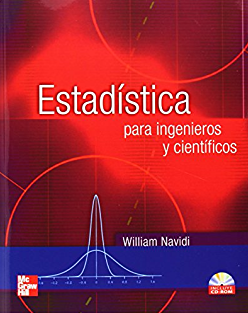

```{r setup, include=FALSE}
knitr::opts_chunk$set(echo = TRUE)
```

# ¿Qué es estadística?

La **incertidumbre** es un estado de información incompleta.

La **probabilidad** es la rama de las matemáticas dedicada a la cuantificación de la incertidumbre.

La **estadística** es una ciencia que se ocupa de los métodos y las técnicas para **analizar conjuntos de datos**, con el fin de **tomar decisiones racionales** bajo incertidumbre.


# Clasificación de la estadística

La **estadística descriptiva** caracteriza y representa un grupo de datos utilizando métodos numéricos y gráficos que resumen la información contenida en ellos.

La **estadística inferencial** a partir de un conjunto de datos "menor" (muestra) permite efectuar estimaciones, predicciones y otras generalizaciones sobre un conjunto de datos "mayor" (población).


# Algunos términos importantes

## Población, colectivo o universo

Conjunto de todos los individuos o mediciones que satisfacen las características propias del estudio.

- **Población finita**: el número de elementos que la conforma es finito. 
- **Población infinita**: el número de elementos que la forma es infinito (o es tan grande que se puede considerar como infinito). 

## Muestra

Subconjunto de individuos o mediciones de una población. 

- **Muestra no probabilística**: la selección de los elementos de la muestra se realiza de forma subjetiva.
- **Muestra probabilística**: todos los elementos de la población tienen una posibilidad de hacer parte de la muestra.

## Variable

Característica observable o medible de un individuo que se expresa de acuerdo con con una escala de medición bien definida. 

- **Variables cualitativas**: se expresan en forma verbal como categorías o atributos. 
- **Variables cuantitativas**: varían en términos de cantidad y se expresan en forma numérica (discretas o continuas).

- **Discretas**: existe una cantidad finita o infinita numerable de valores de la variable entre dos posibles valores cualesquiera de la misma.
- **Continuas**: existe una cantidad infinita no numerable       de valores de la variable entre dos posibles valores cualesquiera de la misma.

### Ejemplo {-}

- El género, la raza, la afiliación política, la nacionalidad y la profesión son ejemplos de variables cualitativas.
- La edad, el peso, la estatura, la temperatura y el salario son ejemplos de variables cuantitativas.
- El número de hijos de una persona es una variable cuantitativa discreta.
- El salario en millones de pesos es una variable cuantitativa continua.


# Estadísticos y parámetros

Un **estadístico** es una cantidad definida sobre los valores de una variable observados en una muestra. 

Un **parámetro**   es una cantidad definida sobre los valores de una variable observados en una población. 

### Ejemplo {-}

- **Estadístico**: promedio muestral, 
$$
\bar{x} =\frac{1}{n} \sum_{i=1}^{n} x_i\,,
$$
donde $n$ es el tamaño de la muestra.

- **Parámetro**: promedio poblacional (población finita), 
$$
\mu =\frac{1}{N} \sum_{i=1}^{N} x_i\,,
$$
donde $N$ es el tamaño de la población.


# Estudios experimentales y observacionales 

Un **estudio experimental**  es un procedimiento llevado a cabo para apoyar, refutar, o validar una hipótesis.

Un **estudio observacional** es un procedimiento en el que no hay una intervención directa por parte del investigador.

A menudo es razonable sacar **conclusiones causales** basadas en experimentos, mientras que los estudios observacionales se usan para mostrar asociaciones o apoyar la formulación de una hipótesis que luego se puede verificar mediante un experimento.


# Medición

La **medición** es un proceso mediante el cual se asignan valores cuantitativos o cualitativos a los atributos de los elementos objeto de estudio, de acuerdo con unas reglas claramente preestablecidas.

Una **escala de medición** es un esquema específico para asignar símbolos o números con el objeto de designar los valores de una variable. 

- **Escala nominal**: se clasifican los individuos respecto a las categorías del atributo. Ejemplo: tipo de material.
- **Escala ordinal**: se clasifican los individuos en una posición en relación con los niveles del atributo, pero sin precisar la distancia que hay entre las posiciones. Ejemplo: clasificación del pH como ácido, neutro y básico.
- **Escala de intervalo**: la diferencia entre dos niveles del atributo representa una distancia real que se mantiene para intervalos semejantes. No posee un cero absoluto. Ejemplo: temperatura.
- **Escala de razón**: el valor del cero es absoluto. Ejemplo: peso.


# Etapas

```{r, eval = TRUE, echo=FALSE, out.width="100%", fig.pos = 'H', fig.align = 'center'}
knitr::include_graphics("01-cycle.png")
```

# Referencias

```{r, eval = TRUE, echo=FALSE, out.width="25%", fig.pos = 'H', fig.align = 'center'}
knitr::include_graphics("01-sosacoverbook.png")
```

```{r, eval = TRUE, echo=FALSE, out.width="25%", fig.pos = 'H', fig.align = 'center'}
knitr::include_graphics("01-devorecoverbook.jpg")
```

```{r, eval = TRUE, echo=FALSE, out.width="25%", fig.pos = 'H', fig.align = 'center'}

```

```{r, eval = TRUE, echo=FALSE, out.width="25%", fig.pos = 'H', fig.align = 'center'}
knitr::include_graphics("01-wackerlycoverbook.jpg")
```