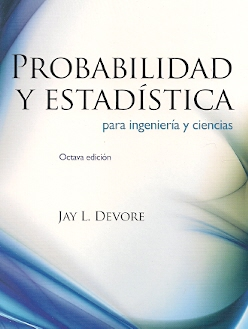

```{r setup, include=FALSE}
knitr::opts_chunk$set(echo = TRUE)
```

# Introducción

Las variables cuantitativas se pueden resumir con varios tipos de medidas, que permiten caracterizar su comportamiento bien sea en la muestra o en la población observada:

- Tendencia central.
- Localización.
- Variabilidad.
- Forma.
 
Dado que en general no se acostumbra a medir toda la población (censo), generalmente las mediciones se hacen sobre una muestra, por lo que las medidas que se presentan a continuación se denominan **muestrales**.

# Medidas de tendencia central

Existen diferentes medidas de tendencia central. Las más utilizadas son la **media aritmética** (promedio), la **mediana**, y la **moda**.

Como su nombre lo indica, el propósito consiste en proporcionar un valor que describa adecuadamente el **centro** del conjunto de datos.

La interpretación de estas medidas debe tener en cuenta las medidas de variabilidad, ya que la calidad de las medidas de tendencia central está relacionada intrínsecamente con la **dispersión** de los datos.

## Media aritmética

Asumiendo que los valores observados en la muestra son $x_1,\ldots,x_n$, la media aritmética es el valor que se ubica en el **centro de gravedad de los datos**, el cual se calcula como:
$$M(x)=\bar{x}=\frac{1}{n}\sum_{i=1}^{n}x_i$$

### Características

- Otorga a todas las observaciones la misma importancia relativa, $\frac{1}{n}$.
- Corresponde al centro de gravedad de los datos, es decir, $\sum_{i=1}^n (x_i - \bar{x}) = 0$.
- Es sensible a datos atípicos.
- No es una buena representación del centro de los datos cuando su distribución es marcadamente asimétrica (sesgada).

### Ejemplo

Los siguientes datos corresponden a la resistencia a la flexión (en megapascales, MPa = $10^6$ Pa, con Pa = Newton/m$^2$) de un determinado tipo de concreto de alto desempeño obtenido con el uso de superplastificantes y ciertos aglomerantes (ver *Magazine of Concrete Research*, 1997, p. 81-98, para más detalles). Calcular la resistencia a la flexión promedio.

5.9, 7.2, 7.3, 6.3, 8.1, 6.8, 7.0, 7.6, 6.8, 6.5, 7.0, 6.3, 7.9, 9.0, 8.2, 8.7, 7.8, 9.7, 7.4, 7.7, 9.7, 7.8, 7.7, 11.6, 11.3, 11.8, 10.7

```{r, eval = TRUE, echo=FALSE, out.width="27%", fig.pos = 'H', fig.align = 'center'}
knitr::include_graphics("03-Pa.jpg")
```

El tamaño de la muestra es $n=27$, y además, el promedio de resistencia a la flexión correspondiente está dado por:
$$
M(x) = \frac{1}{27}(5.9 + 7.2 + \ldots + 10.7) = 8.141\,.
$$

```{r}
# resistencias
x <- c(5.9, 7.2, 7.3, 6.3, 8.1, 6.8, 7.0, 7.6, 6.8, 6.5, 7.0, 6.3, 7.9, 9.0, 
       8.2, 8.7, 7.8, 9.7, 7.4, 7.7, 9.7, 7.8, 7.7, 11.6, 11.3, 11.8, 10.7)
# tamaño de la muestra
length(x)
# media
mean(x)
# otra manera
sum(x)/length(x)
# suma de las desviaciones
sum(x - mean(x))
```

### Propiedades

1. $\min\{x_i\}\leq M(x)\leq \max\{x_i\}$.
2. Si $k$ es una constante y $x_1=k,\ldots,x_n=k$, entonces $M(x)=k$.
3. Si $k$ es una constante, entonces $M(x+k)=M(x)+k$.
4. Si $k$ es una constante, entonces $M(kx)=kM(x)$.
5. Si $k_1$ y $k_2$ son constantes, entonces $M(k_1 + k_2x)=k_1 + k_2M(x)$.
6. Si los datos se encuentran particionados en $m$ grupos con tamaños $n_1,\ldots,n_m$ y medias $M_1(x),\ldots,M_m(x)$, respectivamente, entonces la media correspondiente a todo el conjunto de datos está dada por:
$$
M(x)=\frac{1}{n}\sum_{j=1}^{m} n_j M_j(x)
$$


### Ejemplo

De 500 estudiantes cuya estatura promedio es 1.57 metros, 150 son mujeres. Si la estatura promedio de las mujeres es 1.52 metros, ¿cuál es la estatura promedio de los hombres?

En este caso $n=500$ (total de individuos en la muestra), $n_1=150$ (total de mujeres), y $n_2=500-150=350$ (total de hombres). Además, el promedio "global" es $\bar{x} = 1.57$ y el promedio de las mujeres es $\bar{x}_1 = 1.52$. Si $\bar{x}_2$ denota el promedio de los hombres, entonces:
$$
    \bar{x} = \frac{n_1\bar{x}_1 + n_2\bar{x}_2}{n}
    \quad\Rightarrow\quad
    \bar{x}_2 = \frac{(1.57)(500) - (150)(1.52)}{350}=1.591\,.
$$
Así, el promedio de los hombres es 1.591 metros.

```{r}
# promedio de los hombres
(1.57*500 - 150*1.52)/350
```


### Datos agrupados por valores

Considere la siguiente tabla de frecuencias asociada con los valores de una variable:

| Valor    |F. Absoluta | F. Relativa |
|:--------:|:----------:|:-----------:|
| $y_1$    | $n_1$      | $h_1$       | 
| $\vdots$ | $\vdots$   | $\vdots$    |
| $y_m$    | $n_m$      | $h_m$       |
| Total    | $n$        | $1$         |

En este caso el promedio se calcula como:
$$
  M(y)=\bar{y}=\frac{1}{n}\sum_{j=1}^{m}n_jy_{j}=\sum_{j=1}^{m}h_jy_j
$$

### Ejemplo

La siguiente tabla está asociada con el número de hermanos de un grupo de estudiantes. Calcular el número de hermanos promedio.

| No. Hermanos | F. Absoluta | 
|:--------:|:-------:|
| 0        |  38     |
| 1        |  67     |
| 2        |  44     |
| 3        |  32     |
| 4        |  11     |
| 5        |  8      |
| Total    |  200    |

El número promedio de hermanos para estos $n=200$ estudiantes es de $1.675$, ya que
$$M(y)=\frac{1}{200}(0*38+1*67+2*44+3*32+4*11+5*8)=\frac{335}{200}=1.675$$


Note que el valor del promedio no es necesariamente un valor plausible de la variable, ya que no es posible tener $1.675$ hermanos.

```{r}
# número de hermanos
yj <- c(0, 1, 2, 3, 4, 5)
# frecuencia absoluta
nj <- c(38, 67, 44, 32, 11, 8)
# tamaño de la muestra
sum(nj)
# frecuencia relativa
hj <- nj/sum(nj)
print(hj)
# promedio
sum(nj*yj)/sum(nj)
# otra manera
sum(hj*yj)
```

### Datos agrupados por intervalos

Para las variables continuas, la información se presenta en una tabla de frecuencias donde los datos se encuentran agrupados por intervalos:

| Intervalo | Marca de clase | F. Absoluta | F. Relativa |  
|:-----------------:|:--------:|:-------:|:-------:|
| $l_{0}-l_{1}$   | $y_1$    | $n_1$   | $h_1$   |
| $l_{1}-l_{2}$   | $y_2$    | $n_2$   | $h_2$   |
| $\vdots$          | $\vdots$ | $\vdots$| $\vdots$|
| $l_{m-1}-l_{m}$ | $y_m$    | $n_m$   | $h_m$   |

donde $y_j=\frac{l_{j-1}+l_{j}}{2}$ es la **marca de clase** del intervalo $j$. En este caso el promedio se calcula como:
$$
M(y)=\bar{y}\approx \frac{1}{n}\sum_{j=1}^{m}n_jy_{j}=\sum_{j=1}^{m}h_jy_j
$$
¿En la fórmula anterior, por qué se utiliza $\approx$ en lugar de $=$?

### Ejemplo

La siguiente tabla resume con intervalos el peso (kg) de una muestra de materiales. Calcular el peso promedio.

| Intervalo | Marca de clase   | F. Absoluta | 
|:-------------------:|:-------:|:-----:|
|$15-16$              |$15.5$   |$2$    |
|$16-17$              |$16.5$   |$5$    |
|$17-18$              |$17.5$   |$29$   |     
|$18-19$              |$18.5$   |$76$   |
|$19-20$              |$19.5$   |$118$  |
|$20-21$              |$20.5$   |$96$   |
|$21-22$              |$21.5$   |$83$   |
|$22-23$              |$22.5$   |$37$   |
|$23-24$              |$23.5$   |$4$    |

El número de intervalos es $m=9$ y el tamaño de la muestra es $n=\sum_{j=1}^{m} n_j = 450$. De este modo, la media asociada con este conjunto de datos agrupados está dada por:
$$M(y)\approx\frac{1}{n}\sum_{j=1}^{n}n_j\,y_{j}=\frac{1}{450}\left( 2*15.5 + 5*16.5 + \ldots + 4*23.5 \right)=20.015\,.$$
Por lo tanto, el peso promedio de este grupo de materiales es 20.015 kg.

```{r}
# limite inferior de los intervalos
li <- 15:23
# limite superior de los intervalos
ls <- 16:24
# marca de clase
yj <- (li+ls)/2
print(yj)
# numero de intervalos
length(yj)
# frecuencia absoluta
nj <- c(2, 5, 29, 76, 118, 96, 83, 37, 4)
# tamaño de la muestra
sum(nj)
# frecuencia relativa
hj <- nj/sum(nj) 
print(hj)
# media
sum(nj*yj)/sum(nj)
# otra manera
sum(hj*yj)
```

## Media aritmética ponderada

La media aritmética otorga igual peso a cada observación: $1/n$. Sin embargo, en algunas ocasiones la importancia relativa de los datos no es la misma, por lo que los datos son ponderados de tal forma que esta importancia se ve reflejada en las medidas estadísticas correspondientes.

La **media aritmética ponderada** es un promedio que tiene en cuenta la importancia relativa de cada uno de los datos, la cual se calcula como:
\[
    M(x)=\frac{\sum_{i} w_i x_i}{\sum_{i} w_i}
\]
donde $w_i$ es la **ponderación** y $x_i$ es el dato, la clase o la marca de clase correspondiente.

### Ejemplo 

Las calificaciones de un estudiante están conformadas de acuerdo con la información que se presenta en la siguiente tabla. Calcular la calificación promedio del estudiante.

| Actividad     | Calificación | Valor |
|---------------|:------------:|:-----:|
| Examen        | 4.5          | 40\%  |
| Trabajo       | 1.0          | 10\%  |
| Investigación | 3.5          | 50\%  |

Se observa que las actividades académicas no tienen el mismo peso en la evaluación. Por lo tanto, siguiendo la fórmula del promedio ponderado se obtiene que el promedio del estudiante es:
\[
    M(x) = \frac{\sum_{i} w_i x_i}{\sum_{i} w_i} = \frac{(4.5)(0.4) + (1.0)(0.10) + (3.5)(0.50) }{0.40 + 0.10 + 0.50} =3.65.
\]
Luego, el promedio del estudiante en esta asignatura es 3.65.

```{r}
# calificacion
x <- c(4.5, 1.0, 3.5)
# valor
w <- c(40, 10, 50)/100  # w <- c(0.4, 0.1, 0.5) 
print(w)
# suma de los pesos
sum(w)
# promedio
sum(w*x)/sum(w)
```

## Mediana

La **mediana** o **percentil 50** del conjunto de datos $x_1,\ldots, x_n$ corresponde al **valor que acumula el $50\%$** de los datos, la cual se calcula como:

\[
P_{50}=
\begin{cases}
 x_{\left(\frac{n+1}{2}\right)} & \text{si $n$ es impar}\\
 \frac{x_{\left(\frac{n}{2}\right)}+x_{\left(\frac{n}{2}+1\right)}}{2} & \text{si $n$ es par}
\end{cases}
\]
donde $x_{(i)}$ es la observación que ocupa la $i$-ésima posición del conjunto de datos ordenado ascendentemente.   

### Características

- Se calcula para variables medidas en al menos una escala ordinal.
- No se basa en la magnitud de los datos.
- Es robusta (no se ve afectada) a datos atípicos. 
- Se recomienda su uso cuando la distribución de los datos es considerablemente asímetrica (sesgada).
- La media y la mediana coinciden cuando la distribución de los datos es simétrica.
- No tiene propiedades aritméticas directas y sencillas de aplicar como la media aritmética.

### Ejemplo

Calcular e interpretar la mediana del conjunto de datos asociados con el concreto de alto desempeño.

Dado que el tamaño de la muestra es un número impar, $n=27$, se tiene que la mediana corresponde a la observación ubicada en la posición $\frac{n+1}{2}=14$ del conjunto de datos ordenados ascendentemente, esto es, $P_{50} = x_{(14)} = 7.7$. Por lo tanto, el 50% de las resistencias a la flexión es menor (mayor) o igual a 7.7. Además, se observa que en este caso la mediana (7.7) es ligeramente inferior que la media (8.141), lo cual sugiere que la distribución de las resistencias presenta un leve sesgo positivo (a la derecha).

```{r}
# resistencias
x <- c(5.9, 7.2, 7.3, 6.3, 8.1, 6.8, 7.0, 7.6, 6.8, 6.5, 7.0, 6.3, 7.9, 9.0, 
       8.2, 8.7, 7.8, 9.7, 7.4, 7.7, 9.7, 7.8, 7.7, 11.6, 11.3, 11.8, 10.7)
# tamaño de la muestra
n <- length(x)
print(n)
# posicion central
pos <- (n+1)/2
print(pos)
# ordenar datos ascendentemente
x <- sort(x, decreasing = FALSE)
print(x)
# mediana, dato en la posicion (n+1)/2
x[pos]
# otra manera
median(x)
# otra manera
quantile(x, probs = 0.5)
```

### Ejemplo

Los datos de la siguiente tabla corresponden al número de hijos de una muestra de empleados. Calcular e interpretar la mediana.

|Número de hijos | 0  | 1  | 2  | 3  | 4  | Total |
|:--------------:|:--:|:--:|:--:|:--:|:--:|:-----:| 
| F. Absoluta    | 12 | 12 | 6  | 4  | 6  | 40    |

El tamaño de la muestra es $n=40$. Ahora, debido a que el total de datos es par y que los datos de la tabla están organizados ascendentemente, se tiene que la mediana es el valor ubicado entre las observaciones de las posiciones $\frac{n}{2} = 20$ y $\frac{n}{2} + 1 = 21$. Por lo tanto, la mediana es $P_{50} = \frac{1+1}{2} = 1$. Este valor indica que la mitad de los empleados no tienen hijos o tienen uno solo.

```{r}
# numero de hijos
y <- 0:4
# frecuencia absoluta
nj <- c(12, 12, 6, 4, 6)
# tamaño de la muestra
n <- sum(nj)
print(n)
# posiciones centrales
n/2
n/2 + 1
# frecuencias acumuladas
cumsum(nj)
# mediana, promedio de los datos en las posiciones n/2 y n/2 + 1
(y[2] + y[2])/2
# en este caso no se debe utilizar las funciones median y quantile dado que los
# datos estan agrupados en una tabla
```

### Datos agrupados por intervalos

Cuando los datos están agrupados en una tabla de frecuencias por intervalos, el cálculo de la mediana es como sigue:
$$
    P_{50}\approx l_{k-1}+a_k\left(\frac{0.5\,n-N_{k-1}}{n_k}\right)
$$
donde $k$ es el **índice del primer intervalo** cuya frecuencia relativa acumulada es mayor o igual a $50\%$.

### Ejemplo

Calcular e interpretar la mediana del peso del conjunto de datos asociados con la muestra de materiales.

| Intervalo | Marca de clase   | F. Absoluta | 
|:-------------------:|:-------:|:-----:|
|$15-16$              |$15.5$   |$2$    |
|$16-17$              |$16.5$   |$5$    |
|$17-18$              |$17.5$   |$29$   |     
|$18-19$              |$18.5$   |$76$   |
|$19-20$              |$19.5$   |$118$  |
|$20-21$              |$20.5$   |$96$   |
|$21-22$              |$21.5$   |$83$   |
|$22-23$              |$22.5$   |$37$   |
|$23-24$              |$23.5$   |$4$    |

El índice del primer intervalo que acumula el $50\%$ de los datos es $k = 5$, y por lo tanto el intervalo de referencia es $(19,20]$. Así, la mediana correspondiente es:
$$
    P_{50} \approx  19+ 1*\left(\frac{0.5*450-112}{118}\right)=19.958\,.
$$
Es decir que el $50\%$ de los materias presentan un peso menor o igual que $19.958$ kg.

```{r}
# limite inferior de los intervalos
li <- 15:23
# limite superior de los intervalos
ls <- 16:24
# frecuencia absoluta
nj <- c(2, 5, 29, 76, 118, 96, 83, 37, 4)
# tamaño de la muestra
n <- sum(nj)
print(n)
# frecuencia relativa
hj <- nj/sum(nj) 
print(hj)
# frecuencia relativa aucumulada
Hj <- cumsum(hj)
print(Hj)
# frecuencia absoluta acumulada
Nj <- cumsum(nj)
print(Nj)
# indice primer intervalo tal que Hj > 0.5
k <- 5
# mediana
li[k] + (ls[k]-li[k])*((0.5*n - Nj[k-1])/nj[k])
# en este caso no se debe utili zar las funciones median y quantile dado que los
# datos estan agrupados en una tabla
```


## Moda

La **moda** de un conjunto de datos agrupados por intervalos corresponde al(a los) valor(res) que maximiza(n) la distribución de frecuencias, la cual se calcula como:
$$
    M_d(x) = l_{k-1}+a_k\left(\frac{n_k-n_{k-1}}{2n_k-n_{k-1}-n_{k+1}}\right)
$$
donde $k$ es el índice del(de los) interlo(s) con mayor frecuencia absoluta.

### Ejercicio

Calcular e interpretar la moda del peso del conjunto de datos asociados con la muestra de materiales.

# Medidas de localización

Las medidas de localización o percetiles son valores que delimitan superiormente un determinado porcentaje de los datos observados.

El percentil $t$ de un conjunto de datos, denotado con $P_t$, se define como un valor tal que $t\%$ de los datos es menor o igual que dicho valor. 

Como casos particulares se tienen los cuartiles (percentiles 25, 50 y 75; la mediana es el percentil 50 o cuartil 2).

## Ejemplo

Calcular e interpretar los cuartiles del conjunto de datos asociados con el concreto de alto desempeño.

El percentil 25 o cuartil 1 es $P_{25}=Q_1 = 7.00$, mientras que el percentil 75 o cuartil 3 es $P_{75} = Q_3 = 7.85$. La mediana está calculada en el Ejemplo 2.3.2. Así, por ejemplo, el 25% de la resistencias es menor o igual que 7.00 MPa.

```{r}
# resistencias
x <- c(5.9, 7.2, 7.3, 6.3, 8.1, 6.8, 7.0, 7.6, 6.8, 6.5, 7.0, 6.3, 7.9, 9.0, 
       8.2, 8.7, 7.8, 9.7, 7.4, 7.7, 9.7, 7.8, 7.7, 11.6, 11.3, 11.8, 10.7)
# percentiles 25, 50, y 75
quantile(x, probs = c(0.25, 0.5, 0.75))
```

## Datos agrupados

Cuando los datos están agrupados en una tabla de frecuencias por intervalos, el cálculo del percentil $t$ es como sigue:
$$
P_{t} = l_{k-1}+a_k\left(\frac{(n)(t/100) - N_{k-1}}{n_k}\right)
$$
donde $k$ es el índice del primer intervalo cuya frecuencia relativa acumulada es mayor o igual a $t\%$.

## Ejercicio

Calcular e interpretar los cuartiles del peso del conjunto de datos asociados con la muestra de materiales.

# Referencias

```{r, eval = TRUE, echo=FALSE, out.width="25%", fig.pos = 'H', fig.align = 'center'}
knitr::include_graphics("01-sosacoverbook.png")
```

```{r, eval = TRUE, echo=FALSE, out.width="25%", fig.pos = 'H', fig.align = 'center'}

```

```{r, eval = TRUE, echo=FALSE, out.width="25%", fig.pos = 'H', fig.align = 'center'}
knitr::include_graphics("01-navidicoverbook.png")
```

```{r, eval = TRUE, echo=FALSE, out.width="25%", fig.pos = 'H', fig.align = 'center'}
knitr::include_graphics("01-wackerlycoverbook.jpg")
```