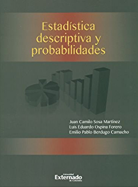
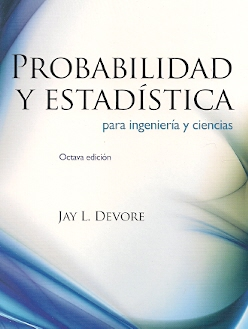
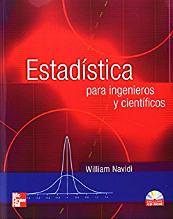
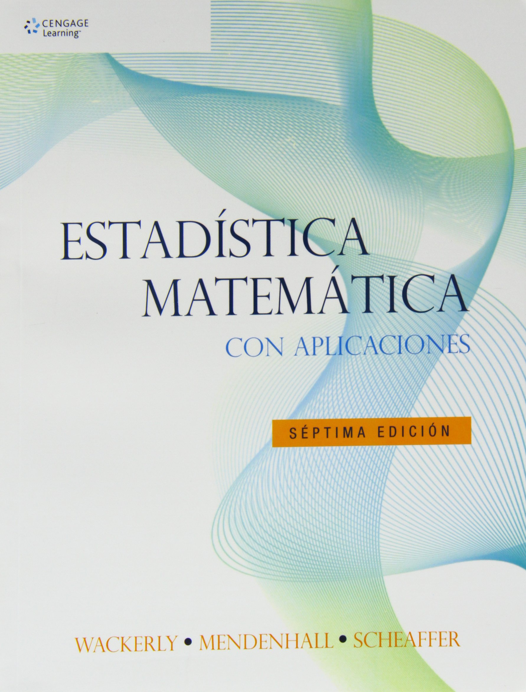

```{r setup, include=FALSE}
knitr::opts_chunk$set(echo = TRUE)
```

# Medida de probabilidad
  
Una medida de probabilidad es una **función** que le asigna un número entre $0$ y $1$ a los eventos de un experimento aleatorio:
$$
A\longrightarrow P(A)
$$
que satisface:
 
- $P(A)\geq0$.
- $P(\Omega)=1$.
- Si $A_1, A_2,\ldots$ son **eventos mutuamente excluyentes** incluidos en $\Omega$, entonces
$$
P\left(\bigcup_{i=1}^{\infty}A_i \right)=\sum_{i=1}^{\infty}P(A_i)\,.
$$

# Algunas propiedades de una medida de probabilidad

Sean $A$ y $E$ eventos aleatorios incluidos en un espacio muestral no vacío $\Omega$ y $P(\cdot)$ una medida de probabilidad sobre $\Omega$. Entonces se satisface que:

- $P(\Phi)=0$.
- $P(A^c)=1-P(A)$.
- $P(A-E)=P(A)-P(A\cap E)$.
- $P(A\cup E)=P(A)+P(E)-P(A\cap E)$.

## Ejercicio

En una encuesta de opinión se obtienen las siguientes frecuencias absolutas:

|        | A favor (F) | En contra (C) | NS/NR (S) |
|:------:|:-----------:|:-------------:|:---------:|
| Hombre | 15          | 21            | 2         |
| Mujer  | 12          | 3             | 1         |

Al elegir una persona al azar, calcular la probabilidad de que:

1. Esté a favor.
2. No esté en contra.
2. Tenga alguna opinión.
2. Sea hombre pero no esté a favor.
2. Sea hombre o esté a favor.
2. No sea hombre y no esté a favor.
2. Sea hombre y tenga alguna opinión.

# Teorema aditivo

Sean $A_1,\ldots,A_m$ eventos aleatorios incluidos en un espacio muestral no vacío $\Omega$ y $P(\cdot)$ una medida de probabilidad sobre $\Omega$. Entonces se satisface que:
$$
P\left(\bigcup_{i=1}^{m} A_i\right)=\sum_{i=1}^{m}P(A_i)-\sum_{i<j}P(A_i\cap A_j)+\sum_{i<j<k}P(A_i\cap A_j\cap A_k)-\ldots-(-1)^{m-1}P\left(\bigcap_{i=1}^{m} A_i \right)\,.
$$  

Para $m=3$:
$$
P(A_1\cup A_2\cup A_3)=P(A_1)+P(A_2)+P(A_3)-P(A_1\cap A_2)-P(A_1\cap A_3)-P(A_2\cap A_3)+P(A_1\cap A_2\cap A_3)\,.
$$

# Probabilidad condicional

Sean $A$ y $E$ eventos aleatorios incluidos en un espacio muestral no vacío $\Omega$ y $P(\cdot)$ una medida de probabilidad sobre $\Omega$. La **probabilidad condicional** es una medida de probabilidad definida por:
$$
P(A\mid E)=\frac{P(A\cap E)}{P(E)}
$$
siempre que $P(E) > 0$.

Dado que la probabilidad condicional también constituye una medida de probabilidad, entonces también se satisfacen las propiedades de probabilidad. Por ejemplo:

- $P(\Phi\mid E)=0$.
- $P(A^c\mid E)=1-P(A\mid E)$.
- $P(A-B\mid E)=P(A\mid E)-P(A\cap B\mid E)$.
- $P(A\cup B\mid E)=P(A\mid E)+P(B\mid E)-P(A\cap B\mid E)$.

## Ejercicio

Continuando con el ejercicio de la encuesta de opinión. 

Al elegir una persona al azar:

1. Si el individuo elegido es hombre, calcular la probabilidad de que esté en contra.
2. Si el individuo elegido no está en contra, calcular la probabilidad de que sea mujer.

# Teorema multiplicativo

Sean $A$ y $E$ eventos aleatorios incluidos en un espacio muestral no vacío $\Omega$ y $P(\cdot)$ una medida de probabilidad sobre $\Omega$. Entonces se satisface que:
$$
P(A\cap E)=P(A\mid E)\,P(E)\,.
$$

Además, si $A$ y $E$ son eventos **independientes**, es decir, si $A$ y $E$ son eventos tales que $P(A\mid E) = P(A)$, entonces:
$$
P(A\cap E)=P(A)\,P(E)\,.
$$

## Ejercicio

Una empresa dispone de dos gerentes operativos que trabajan independientemente. La probabilidad de que cada funcionario esté disponible cuando se le necesite es 0.9.

1. ¿Cuál es la probabilidad de que ningún funcionario esté disponible cuando se le necesite?
2. ¿Cuál es la probabilidad de que por lo menos un funcionario esté disponible cuando se le necesite?

# Teorema de la probabilidad total

Sea $E_1,\ldots, E_m$ una partición de un espacio muestral no vacío $\Omega$, es decir, $E_1, E_2,\ldots, E_m$ es una colección de subconjuntos de $\Omega$ tales que:
$$
\bigcup_{i=1}^m E_i=\Omega
\qquad\text{y}\qquad
E_i\cap E_j=\Phi\,,\,\text{para }i\neq j\,.
$$
Entonces, la probabilidad de un evento $A$ se puede calcular como:
$$
P(A) = \sum_{j=1}^{m} P(A\mid E_j)\,P(E_j)\,.
$$
Para $m=2$:
$$
P(A) =  P(A\mid E_1)\,P(E_1) +  P(A\mid E_2)\,P(E_2)\,.
$$

```{r, eval = TRUE, echo=FALSE, out.width="80%", fig.pos = 'H', fig.align = 'center'}
knitr::include_graphics("07-teo_prob_total.png")
```

# Teorema de Bayes

Sea $E_1,\ldots, E_m$ una partición de un espacio muestral no vacío $\Omega$. Entonces, la probabilidad de $E_k$, para $k=1,\ldots,m$, dado un evento $A$ se puede calcular como:
$$
P(E_k\mid A)=\frac{P(A\mid E_k)P(E_k)}{\sum_{j=1}^{m}P(A\mid E_j)\,P(E_j)}\,.
$$
Para $m=2$:
$$
P(E_k\mid A)=\frac{P(A\mid E_k)\,P(E_k)}{P(A\mid E_1)\,P(E_1) +  P(A\mid E_2)\,P(E_2)}\quad\text{para }k=1,2\,.
$$

## Ejemplo

Una empresa elabora sus productos en cuatro fábricas. El porcentaje de producción total que se elabora en cada fábrica es del 40\%, 30\%, 20\%, y 10\%. Además, el porcentaje de artículos defectuosos en cada fábrica es del 1\%, 2\%, 7\%, y 4\%, respectivamente. 
Calcular la probabilidad de que un artículo que resulta ser defectuoso provenga de la primera fábrica.

De acuerdo con el teorema de Bayes se tiene que:
$$
\begin{align*}
P(F_1|A) &=\frac{P(F_1)P(A |F_1)}{\sum_{i=1}^{4} P(F_i)P(A|F_i)}\\
&= \frac{P(F_1)P(A|F_1)}{P(F_1)P(A|F_1) + P(F_2)P(A|F_2) + P(F_3)P(A|F_3)+ P(F_4)P(A|F_4)} \\
&= \frac{(0.4)(0.01)}{ (0.4)(0.01) + (0.3)(0.02) + (0.2)(0.07) + (0.1)(0.04)} \\
&= 0.14285.
\end{align*}
$$
Por lo tanto, a probabilidad de que un artículo que resulta ser defectuoso provenga de la primera fábrica es 0.14285.

## Ejercicio

La prueba de detección de ácidos nucleicos (PCR) es una prueba para el diagnóstico de la COVID-19.
Como toda prueba diagnóstica, la prueba PCR no es absolutamente infalible. 
De acuerdo con https://www.ncbi.nlm.nih.gov/pmc/articles/PMC7984870/, 
si una persona sí está contagiada, entonces la prueba tiene una probabilidad de    señalización de 0.875 (sensibilidad). 
Si una persona no está contagiada, entonces la prueba tiene una probabilidad de no señalización de 0.995 (especificidad). 

Bogotá tiene 12.1 casos activos de Covid-19 por cada 100,000 habitantes (https://saludata.saludcapital.gov.co/osb/index.php/datos-de-salud/enfermedades-trasmisibles/covid19/).
Si una persona elegida al azar en Bogotá se realiza una prueba PCR y la prueba resulta negativa, ¿cuál es la probabilidad de que el individuo en realidad no esté contagiado? 


## Ejercicio

Se ha observado que los hombres y las mujeres reaccionan de manera diferente bajo ciertas circunstancias. Investigaciones previas muestran que el $70\%$ de las mujeres reaccionan positivamente, mientras que el porcentaje correspondiente de los hombres es del $40\%$. Se somete un grupo de 15 mujeres y 5 hombres a una prueba en la que se pide llenar un cuestionario para descubrir sus reacciones. Una prueba escogida al azar resultó negativa, ¿cuál es la probabilidad de que haya sido contestada por un hombre?
	
## Ejercicio

La urna A contiene 5 bolas blancas y 7 bolas negras, mientras que la urna B contiene 3 bolas blancas y 12 bolas negras. Se lanza una moneda corriente. Si el resultado es cara, entonces se extrae una bola de la urna A. Si el resultado es sello, entonces se extrae una bola de la urna B. Una bola blanca resulta ser seleccionada. ¿A qué es igual la probabilidad de	que el resultado del lanzamiento de la moneda haya sido sello?

# Referencias

```{r, eval = TRUE, echo=FALSE, out.width="25%", fig.pos = 'H', fig.align = 'center'}

```

```{r, eval = TRUE, echo=FALSE, out.width="25%", fig.pos = 'H', fig.align = 'center'}

```

```{r, eval = TRUE, echo=FALSE, out.width="25%", fig.pos = 'H', fig.align = 'center'}

```

```{r, eval = TRUE, echo=FALSE, out.width="25%", fig.pos = 'H', fig.align = 'center'}

```