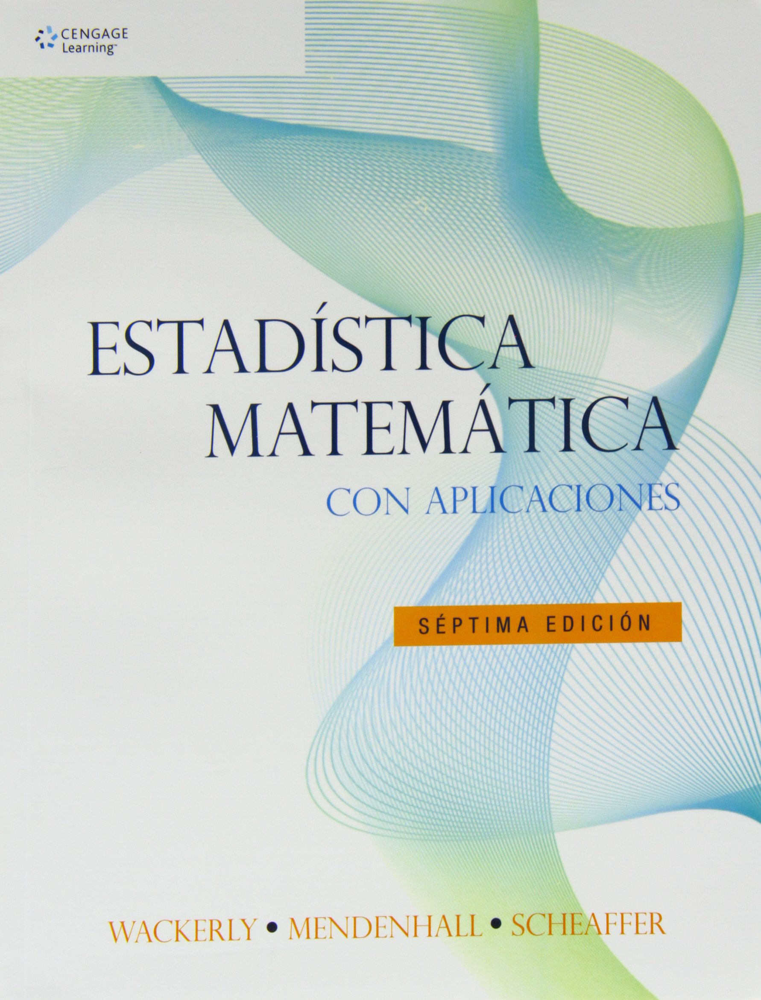

```{r setup, include=FALSE}
knitr::opts_chunk$set(echo = TRUE)
```

# Introducción

Cuando la variable objeto de estudio es continua, no tiene sentido hacer una suma de las probabilidades de cada uno de los valores de la variable como con las variables discretas, ya que el **conjunto de valores que toma una variable continua es no numerable**. 

En este caso, se deben generalizar los conceptos correspondientes, empleando **integrales** en lugar de sumatorias.

# Variables aleatorias continuas

Una función $f_X : \mathbb{R} \longrightarrow [0,\infty)$ se dice que es una **función de densidad de probabilidad** (f.d.p.) de una variable aleatoria continua (v.a.c.) $X$ si satisface las siguientes condiciones:

- $f_X(x)\geq 0$ para todo $x \in \mathbb{R}$.
- Para cualquier par de números reales $a$ y $b$ tales que $a\leq b$, se tiene que:
\[
\textsf{P}(a \leq X \leq b) = \int_{a}^{b} f_X(x)\,dx\,.
\]
- El área bajo toda la gráfica de $f_X$ es 1, esto es: 
\[
\int_{-\infty}^{+\infty} f_X(x)\, dx = 1\,.
\]

## Ejemplo

Suponga que $X$: "tiempo de ejecución de un proceso en minutos", tiene la siguiente función de densidad:
$$
f_X(x)=\frac{1}{15}e^{-\frac{1}{15}x}\,,\qquad x > 0\,.
$$
Calcular la probabilidad de que el tiempo de ejecución sea menos de 10 minutos.

Se debe calcular $P(X<10)$, es decir, el área bajo la curva de la función de densidad entre 0 y 10:
$$
P(X<10) = \int_0^{10} \frac{1}{15}e^{-\frac{1}{15}x}\,dx = -e^{-\frac{1}{15}x}\Big|_{0}^{10} = 1 - e^{-2/3} = 0.4865
$$

```{r warning=FALSE}
#función de densidad
f <- function(x) (1/15)*exp((-1/15)*x)
curve(expr = f, from = 0, to = 100, lwd = 2, xlab = "Tiempo", ylab = "f(x)", main = "Función de densidad")
grid <- seq(from = 0, to = 10, len = 1000)
polygon(x = c(0,grid,10), y = c(0,f(grid),0), col = "mistyrose", border = "mistyrose")
curve(expr = f, from = 0, to = 100, lwd = 2, add = T)
#área bajo la curva
pracma::integral(f,0,10)
```

## Función de distribución 

La **función de distribución** de una v.a.c. $X$ con función de densidad $f_X$, es la función $F_X : \mathbb{R} \longrightarrow [0,1]$ definida por:
\[
F_X(x) = \textsf{P}(X \leq x)=\int_{-\infty}^{x} f_X(u)\, du
\]
para todo número real $x$.

## Propiedades

Si $F_X$ es una función de distribución de una v.a.c. $X$, entonces se satisfacen las siguientes propiedades:

- Si $x$ es un número real, entonces $0 \leq F_X(x) \leq 1$ y además
\[
\lim_{x\rightarrow -\infty} F_X(x)=0 \quad\text{y}\quad \lim_{x\rightarrow \infty} F_X(x)=1.
\]
- Si $x$ es un número real, entonces
\[
\textsf{P}(X = x) = 0 \quad\text{y}\quad \textsf{P}(X \geq x) = \textsf{P}(X > x) = 1 - F_X(x).
\]
- Si $a$ y $b$ son dos números reales tales que $a \leq b$, entonces $F_X(a) \leq F_X(b)$, es decir $F$ es creciente; y además se tiene que
\[
\textsf{P}(a \leq X \leq b) = \textsf{P}(a \leq X < b) = \textsf{P}(a < X \leq b) = \textsf{P}(a < X < b)=F_X(b)-F_X(a).
\]
- Si $f_X$ es la f.d.p. de $X$, entonces
\[
f_X(x) = \frac{d}{dx}F_X(x)\,.
\]

## Ejemplo

Continuando con el ejemplo del tiempo de ejecución de una tarea, hallar la función de distribución.

Se debe hallar $F_X$, es decir, el área bajo la curva de la función de densidad entre 0 y $x$:
$$
F_X(x) = P(X\leq x) = \int_0^{x} \frac{1}{15}e^{-\frac{1}{15}u}\,du = -e^{-\frac{1}{15}u}\Big|_{0}^{x} = 1 - e^{-x/15}\,\qquad x >0\,.
$$

Por lo tanto,
$$
F_X(x)=\left\{
           \begin{array}{ll}
            1- e^{-x/15}, & \hbox{si $x>0$;} \\
            0, & \hbox{en otro caso.}
           \end{array}
         \right.
$$

```{r}
# f.d.p.
f <- function(x) (1/15)*exp(-(1/15)*x)
# función de distribución
G <- function(x) 1 - exp(-(1/15)*x)
# gráfica
curve(expr = G, from = 0, to = 100, lwd = 2, xlab = "Tiempo", ylab = "F(x)", main = "Función de distribución")
```

## Ejercicio

Continuando con el ejemplo del tiempo de ejecución de una tarea, hallar una expresión general para el percentil $p$.

Sea $X$ una v.a.c. con f.d.a. $F_X$ y $p$ un número real tal que $0\leq p\leq 100$. El **percentil** $p$ de la distribución de $X$, denotado con $\pi_p$, es un valor tal que
\[
\frac{p}{100}=F_X(\pi_p)\,.
\]

## Ejercicio

La variable aleatoria que denota las utilidades diarias de una empresa de consultoría (en millones de pesos) tiene la siguiente función de densidad de probabilidad:
$$
f_X(x)=\left\{
           \begin{array}{ll}
            k\,x^2, & \hbox{si $-1<x<2$;} \\
            0, & \hbox{en otro caso.}
           \end{array}
         \right.
$$

a. Hallar el valor de $k$.
b. Hallar la función de distribución de las utilidades.
c. Calcular la probabilidad de que la empresa tenga perdidas.
d. Calcular la probabilidad de que la empresa tenga ganancias.
e. Calcular la probabilidad de que la empresa tenga ganancias superiores a un millón de pesos.
f. Calcular los cuartiles de las utilidades.

# Referencias

```{r, eval = TRUE, echo=FALSE, out.width="25%", fig.pos = 'H', fig.align = 'center'}
knitr::include_graphics("01-sosacoverbook.png")
```

```{r, eval = TRUE, echo=FALSE, out.width="25%", fig.pos = 'H', fig.align = 'center'}
knitr::include_graphics("01-devorecoverbook.jpg")
```

```{r, eval = TRUE, echo=FALSE, out.width="25%", fig.pos = 'H', fig.align = 'center'}
knitr::include_graphics("01-navidicoverbook.png")
```

```{r, eval = TRUE, echo=FALSE, out.width="25%", fig.pos = 'H', fig.align = 'center'}

```
