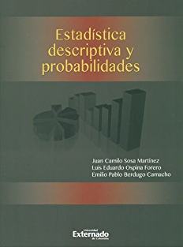

```{r setup, include=FALSE}
knitr::opts_chunk$set(echo = TRUE)
```

# Introducción

Se consideran **dos poblaciones**, a saber, $X\sim \textsf{N}(\mu_X,\sigma_X^2)$ y $Y\sim \textsf{N}(\mu_Y,\sigma_Y^2)$, de las cuales se tienen **muestras aleatorias independientes** $X_1,\ldots,X_{n_X}$ y $Y_1,\ldots,Y_{n_Y}$, respectivamente. 

El objetivo es **comparar los parámetros** de las dos poblaciones.

# Diferencia de medias $\mu_X-\mu_Y$

El estimador puntual de $\mu_X-\mu_Y$ es la **diferencia de medias muestrales** $\bar{X} - \bar{Y}$, el cual corresponde a un **estimador insesgado** de $\mu_X-\mu_Y$,
$$
\textsf{E}(\bar{X} - \bar{Y}) = \textsf{E}(\bar{X}) - \textsf{E}(\bar{Y}) = \mu_X - \mu_Y\,,
$$
con **error estándar** dado por
$$
\textsf{Var}(\bar{X} - \bar{Y}) = \textsf{Var}(\bar{X}) + \textsf{Var}(\bar{Y}) = \frac{\sigma_X^2}{n_X} + \frac{\sigma_Y^2}{n_Y}\,.
$$

## Significacia estadística

La **significancia estadística** (diferencias significativas) se establece por medio de los **signos del los límites del intervalo de confianza** para $\mu_X-\mu_Y$. Si **los dos límites tienen el mismo signo**, entonces, con una confiabilidad de $100(1-\alpha)\%$, existe suficiente **evidencia empírica** para declarar **diferencias significativas** entre $\mu_X$ y $\mu_Y$. 

La **significancia estadística no implica** necesariamente una **significancia práctica**.

¿Qué se puede concluir si los signos de los límites del intervalo no coinciden?

## Varianzas poblacionales conocidas

La **variable aleatoria pivote** está dada por:

$$Z=\frac{(\bar{X}-\bar{Y}) - (\mu_X-\mu_Y)}{\sqrt{\frac{\sigma_X^2}{n_X}+\frac{\sigma_Y^2}{n_Y}}}\sim \textsf{N}(0,1)$$
donde $\bar{X}=\frac{1}{n_X}\sum_{i=1}^{n_X} X_i$ y $\bar{Y}=\frac{1}{n_Y}\sum_{i=1}^{n_Y} Y_i$ son las **medias muestrales** correspondientes.

Entonces:
$$
\textsf{Pr}\left( (\bar{X}-\bar{Y})-\textsf{z}_{1-\alpha/2}\sqrt{\frac{\sigma_X^2}{n_X}+\frac{\sigma_Y^2}{n_Y}} < \mu_X - \mu_Y < (\bar{X}-\bar{Y}) + \textsf{z}_{1-\alpha/2}\sqrt{\frac{\sigma_X^2}{n_X}+\frac{\sigma_Y^2}{n_Y}} \right) = 1-\alpha
$$
donde $\textsf{z}_{1-\alpha/2}$ es el percentil $1-\alpha/2$ de una distribución Normal estándar.

**Observaciones:**

- El **margen de error** es $\textsf{z}_{1-\alpha/2}\sqrt{\frac{\sigma_X^2}{n_X}+\frac{\sigma_Y^2}{n_Y}}$.
- Este **IC es apropiado si las poblaciones tienen distribución Normal** (sin importar los tamaños de muestra). 
- Este **IC es apropiado si los tamaños de muestra son grandes** (sin importar las distribuciones poblacionales). 
- Cuando las muestras son pequeñas, es fundamental que las distribuciones de las dos poblaciones sean Normales.

## Ejemplo

Como parte de un estudio para evaluar las diferencias en la calidad entre dos centros de enseñanza respecto a las ciencias exactas, físicas y naturales (Biología, Física, Geología, Matemáticas y Química), se aplica un examen estandarizado a los individuos de ambos centros. 

En exámenes estandarizados ya practicados en diversas ocasiones, se ha obtenido una desviación estándar cercana a 10 puntos. Por lo tanto, es razonable asumir que las desviaciones estándar poblacionales son conocidas y ambas iguales a $10$ puntos en ambos grupos.

Se tienen los datos de dos muestras aleatorias de tamaños $35$ y $40$ para los centros de enseñanza A y B, respectivamente, para las cuales las medias muestrales correspondientes son $82$ y $78$ puntos. 

Si la diferencia de calidad se evalúa comparando las medias poblacionales de las puntuaciones obtenidas en el examen, usando una confiabilidad de 95\%, ¿estos datos indican que existe una diferencia significativa entre las medias poblacionales de los dos centros de enseñanza?

**Solución:**

Población $X$: puntaje en el examen estadarizado en el centro de enseñanza A.

Población $Y$: puntaje en el examen estadarizado en el centro de enseñanza B.

Parámetro de interés: $\mu_X - \mu_Y$.

Información muestral del centro de enseñanza A: $n_X = 35$ y $\bar{x} = 82$.

Información muestral del centro de enseñanza B: $n_Y = 40$ y $\bar{y} = 78$.

Información poblacional del centro de enseñanza A: $\sigma_X = 10$.

Información poblacional del centro de enseñanza B: $\sigma_Y = 10$.

```{r}
# info muestral
nx   <- 35
ny   <- 40
xbar <- 82
ybar <- 78
# info poblacional
sigx <- 10
sigy <- 10
# estimacion puntual
EP <- xbar - ybar
print(EP)
# margen de error al 95% (Normal)
ME <- qnorm(p = 0.975)*sqrt(sigx^2/nx + sigy^2/ny)
print(ME)
# intevalo de confianza al 95% (Normal)
IC <- EP + c(-1,1)*ME
print(IC)
```

## Varianzas poblacionales desconocidas homocedásticas 

Varianzas poblacionales desconocidas homocedásticas: $\sigma_X^2 = \sigma_Y^2$.

La **variable aleatoria pivote** está dada por:

$$T=\frac{(\bar{X}-\bar{Y}) - (\mu_X-\mu_Y)}{S_p\sqrt{\frac{1}{n_X}+\frac{1}{n_Y}}}\sim \textsf{t}_{n_X+n_Y-2}$$
donde $S^2_p$ es la **varianza conjugada** de las muestras,
$$
S_p^2=\frac{(n_X-1)S^2_{X}+(n_Y-1)S^2_{Y}}{n_X+n_Y-2}
$$
con $S_x^2$ y $S_y^2$ las **varianza muestrales** correspondientes,
$$
S^2_{X}=\frac{1}{n_X-1}\sum_{i=1}^{n_X}(X_i-\bar{X})^2
\qquad\text{y}\qquad
S^2_{Y}=\frac{1}{n_Y-1}\sum_{i=1}^{n_Y}(Y_i-\bar{Y})^2.
$$
Entonces:
$$
\textsf{Pr}\left( (\bar{X}-\bar{Y})-\textsf{t}_{n_X+n_Y-2,1-\alpha/2}\,S_p\sqrt{\frac{1}{n_X}+\frac{1}{n_Y}} < \mu_X - \mu_Y < (\bar{X}-\bar{Y})+\textsf{t}_{n_X+n_Y-2,1-\alpha/2}\,S_p\sqrt{\frac{1}{n_X}+\frac{1}{n_Y}} \right) = 1-\alpha
$$
donde $t_{n_X+n_Y-2,1-\alpha/2}$ es el percentil $1-\alpha/2$ de una distribución $\textsf{t}$ con $n_X+n_Y-2$ grados de libertad.

**Observaciones:**

- El **margen de error** es $\textsf{t}_{n_X+n_Y-2,1-\alpha/2}\,S_p\sqrt{\frac{1}{n_X}+\frac{1}{n_Y}}$.
- Este **IC es apropiado si las poblaciones tienen distribución Normal** (sin importar los tamaños de muestra).
- Este **IC es apropiado si los tamaños de muestra son grandes** (sin importar las distribuciones poblacionales), en cuyo caso $\textsf{t}\approx \textsf{N}(0,1)$.
- Cuando las muestras son pequeñas, es fundamental que las distribuciones de las dos poblaciones sean Normales.
- Con el procedimiento de la varianza combinada puede que no se obtengan resultados satisfactorios si los tamaños de las muestras son muy distintos.

## Ejemplo

En las zonas costeras de un país, hubo durante un periodo de tiempo determinado, un crecimiento relativamente rápido de la población. Los resultados que se presentan a continuación dan cuenta de las edades de dos muestras aleatorias e independientes de personas que viven tanto en zonas costeras como en zonas no costeras. 

|                   | Zona costera | Zona no costera |
|-------------------|:------------:|:---------------:|
| Tamaño muestral   | 150          | 175             |
| Media             | 39.3 años    | 31.4 años       |
| Desv. Estándar    | 15.0 años    | 15.2 años       |

Asumiendo que la variabilidad de la edad de las dos poblaciones es la misma, usando una confiabilidad de 95\%, calcular un intervalo de confianza para la diferencia de las medias de la edad de ambas poblaciones. ¿Existen diferencias significativas? ¿La diferencia es sustancial en términos prácticos? ¿Por qué es razonable asumir que las dos poblaciones son homocedásticas? ¿La distribución de las edades en ambas poblaciones tiene que ser Normal para llevar acabo este procedimiento?

**Solución:**

Población $X$: edad (en años cumplidos) en la zona costera.

Población $Y$: edad (en años cumplidos) en la zona no costera.

Parámetro de interés: $\mu_X - \mu_Y$.

Información muestral de la zona costera: $n_X = 150$, $\bar{x} = 39.3$, y $s_x = 15.0$.

Información muestral de la zona no costera: $n_Y = 175$, $\bar{y} = 31.4$ y $s_y = 15.2$.

Información poblacional: $\sigma^2_X = \sigma^2_Y$.

```{r}
# info muestral
nx   <- 150
ny   <- 175
xbar <- 39.3
ybar <- 31.4
sx   <- 15.0
sy   <- 15.2 
# desviacion estandar conjugada
sp <- sqrt(((nx - 1)*sx^2 + (ny - 1)*sy^2)/(nx + ny - 2))
print(sp)
# estimacion puntual
EP <- xbar - ybar
print(EP)
# margen de error al 95% (Normal)
ME <- qnorm(p = 0.975)*sp*sqrt(1/nx + 1/ny)
print(ME)
# margen de error al 95% (t)
ME <- qt(p = 0.975, df = nx + ny - 2)*sp*sqrt(1/nx + 1/ny)
print(ME)
# intevalo de confianza al 99% (t)
IC <- EP + c(-1,1)*ME
print(IC)
```

## Varianzas poblacionales desconocidas heterocedásticas 

Varianzas poblacionales desconocidas heterocedásticas, $\sigma_X^2 \neq \sigma_Y^2$.

La **variable aleatoria pivote** está dada por:

$$T=\frac{(\bar{X}-\bar{Y})-(\mu_X-\mu_Y)}{\sqrt{\frac{S^2_{X}}{n_X}+\frac{S^2_{Y}}{n_Y}}}\sim \textsf{t}_{\nu}$$

donde $\nu$ denota los **grados de libertad**, y dados por entero más cercano
$$
\nu=\frac{\left(\frac{s^2_{X}}{n_X}+\frac{s^2_{Y}}{n_Y} \right)^2 }{\frac{\left( \frac{s^2_{X}}{n_X}\right)^2 }{n_X-1}+\frac{\left( \frac{s^2_{Y}}{n_Y}\right)^2 }{n_Y-1}}
$$

Entonces:
$$
\textsf{Pr}\left( (\bar{X}-\bar{Y})-\textsf{t}_{\nu,1-\alpha/2}\sqrt{\frac{S^2_{X}}{n_X}+\frac{S^2_{Y}}{n_Y}} < \mu_X - \mu_Y < (\bar{X}-\bar{Y})+\textsf{t}_{\nu,1-\alpha/2}\sqrt{\frac{S^2_{X}}{n_X}+\frac{S^2_{Y}}{n_Y}} \right) = 1-\alpha
$$
donde $\textsf{t}_{\nu,1-\alpha/2}$ es el percentil $1-\alpha/2$ de una distribución $t$ con $\nu$ grados de libertad.

**Observaciones:**

- El **margen de error** es $\textsf{t}_{\nu,1-\alpha/2}\sqrt{\frac{S^2_{X}}{n_X}+\frac{S^2_{Y}}{n_Y}}$.
- Este **IC es apropiado si las poblaciones tienen distribución Normal** (sin importar los tamaños de muestra). 
- Este **IC es apropiado si los grados de libertad son grandes** (sin importar las distribuciones poblacionales), en cuyo caso $\textsf{t}\approx \textsf{N}(0,1)$.
- Cuando las muestras son pequeñas, es fundamental que las distribuciones de las dos poblaciones sean Normales.

## Ejemplo

En el artículo **Bactericidal Properties of Flat Surfaces and Nanoparticles Derivatized with Alkylated Polyethylenimines** (J. Lin, S. Qiu y colaboradores, en *Biotechnology Progress*,
2002:1082-1086), se describen experimentos en los  que se fijó polietileniminas alquiladas a superficies y a nanopartículas para hacerlas bactericidas. 

En una serie de experimentos, la eficiencia bactericida contra la bacteria E. Coli fue comparada para un metilado contra un polímero no metilado. La media del porcentaje de células de bacterias muertas con el polímero metilado era de 95 con una desviación estándar de 1, y la media del porcentaje de células de bacterias muertas con el polímero no metilado era de 70 con una desviación estándar 6.

Se hicieron cinco mediciones independientes para cada tipo de polímero. Determine un intervalo de confianza de 95\% para el aumento en la eficiencia bactericida del polímero metilado. ¿Qué es indispensable suponer para construir este intervalo de confianza usando los métodos tradicionales?

**Solución:**

Población $X$: porcentaje de células de bacterias muertas con el polimero metilado.

Población $Y$: porcentaje de células de bacterias muertas con el polimero no metilado.

Parámetro de interés: $\mu_X - \mu_Y$.

Información muestral del polimero    metilado: $n_X = 5$, $\bar{x} = 95$, y $s_X = 1$.

Información muestral del polimero no metilado: $n_Y = 5$, $\bar{y} = 70$, y $s_Y = 6$.

Información poblacional: $\sigma^2_X \neq \sigma^2_Y$.

```{r}
# info muestral
nx   <- 5
ny   <- 5
xbar <- 95
ybar <- 70
sx   <- 1
sy   <- 6 
# grados de libertad
v <- round((sx^2/nx + sy^2/ny)^2/((sx^2/nx)^2/(nx-1) + (sy^2/ny)^2/(ny-1)))
print(v)
# estimacion puntual
EP <- xbar - ybar
print(EP)
# margen de error al 95% (Normal)
ME <- qnorm(p = 0.975)*sqrt(sx^2/nx + sy^2/ny)
print(ME)
# margen de error al 95% (t)
ME <- qt(p = 0.975, df = v)*sqrt(sx^2/nx + sy^2/ny)
print(ME)
# intevalo de confianza al 95% (t)
IC <- EP + c(-1,1)*ME
print(IC)
```

# Cociente de varianzas $\sigma^2_Y/\sigma^2_X$

El **estimador puntual** de $\frac{\sigma^2_{Y}}{\sigma^2_{X}}$ es $\frac{S^2_{Y}}{S^2_{X}}$.

La significancia estadística se analiza por medio de la magnitud de los límites de los intervalos **tomando como referencia a 1**. ¿Por qué?

¿En qué casos se puede declarar que existen diferencias significativas entre $\sigma^2_Y$ y $\sigma^2_X$?

La **variable aleatoria pivote** está dada por:

$$
F=\frac{\frac{S^2_{X}}{\sigma_X^2}}{\frac{S^2_{Y}}{\sigma_Y^2}}\sim \textsf{F}_{n_X-1,n_Y-1}
$$

```{r}
curve(expr = df(x, df1 = 25, df2 = 29), from = 0, to = 4, col = 2, xlab = expression(F), ylab = "Densidad", main = "F(25,29)")
```


Entonces:
$$
\textsf{Pr}\left( \frac{S^2_{Y}}{S^2_{X}}\textsf{F}_{n_X-1,n_Y-1,\alpha/2} < \frac{\sigma^2_Y}{\sigma^2_X}  <\frac{S^2_{Y}}{S^2_{X}}\textsf{F}_{n_X-1,n_Y-1,1-\alpha/2} \right) = 1-\alpha
$$
donde $F_{n_X-1,n_Y-1,\alpha/2}$ y $F_{n_X-1,n_Y-1,1-\alpha/2}$ son respectivamente los percentiles $\alpha/2$ y $1-\alpha/2$ de una distribución $\textsf{F}$ con $n_X-1$ grados de libertad en el numerador y $n_Y-1$ grados de libertad en el denominador.

**Observaciones:**

- Este **IC es apropiado si las poblaciones tienen distribución Normal** (sin importar los tamaños de muestra).
- Cuando las muestras son pequeñas, es fundamental que las distribuciones de las dos poblaciones sean Normales.

## Ejemplo

*Media Metrix and Jupiter Communications* recogieron datos sobre la cantidad de tiempo que pasan
conectados a Internet, por mes, adultos y jóvenes (*USA Today*, 14 de septiembre de 2000).
Se concluyó que, en promedio, los adultos pasan más tiempo conectados a Internet que los jóvenes.

Para confirmar esto se realiza otro estudio para el que se toma una muestra
de 26 adultos y otra de 30 jóvenes. Las desviaciones estándar de las cantidades de tiempo que
pasan conectados a Internet son 94 y 58 minutos, respectivamente. 

¿Estos resultados muestrales
favorecen la conclusión de que en el caso de los adultos la variabilidad del tiempo que pasan conectados
a Internet es mayor que en el caso de los jóvenes? Use una confiabilidad del 95\%. ¿Qué es indispensable suponer para construir este intervalo de confianza usando los métodos tradicionales?

**Solución:**

Población $X$: cantidades de minutos que pasan conectados a Internet los adultos.

Población $Y$: cantidades de minutos que pasan conectados a Internet los jóvenes.

Parámetro de interés: $\sigma^2_Y/\sigma^2_X$.

Información muestral de los adultos: $n_X = 26$ y $s_X = 94$.

Información muestral de los jóvenes: $n_Y = 30$ y $s_Y = 58$.

```{r}
# info muestral
nx   <- 26
ny   <- 30
sx   <- 94
sy   <- 58
# estimacion puntual
EP <- sy^2/sx^2
print(EP)
# intevalo de confianza al 95% (F)
IC <- (sy^2/sx^2)*c(qf(p = 0.025, df1 = nx-1, df2 = ny-1), qf(p = 0.975, df1 = nx-1, df2 = ny-2))
print(IC)
```

# Diferencia de proporciones, $\pi_X-\pi_Y$

Se consideran **dos poblaciones**, a saber, $X\sim Ber(\pi_X)$ y $Y\sim Ber(\pi_Y)$, de las cuales se tienen las **muestras aleatorias independientes** $X_1,\ldots,X_{n_X}$ y $Y_1,\ldots,Y_{n_Y}$, respectivamente.

El estimador puntual de $\pi_X-\pi_Y$ es la **diferencia de proporciones muestrales** $P_X - P_Y$, el cual corresponde a un **estimador insesgado** de $\pi_X-\pi_Y$,
$$
\textsf{E}(P_X- P_Y) = \textsf{E}(P_X) - \textsf{E}(P_Y) = \pi_X - \pi_Y\,,
$$
con **error estándar** dado por
$$
\textsf{Var}(P_X - P_Y) = \textsf{Var}(P_X) + \textsf{Var}(P_Y) = \frac{\pi_X(1-\pi_X)}{n_X} + \frac{\pi_Y(1-\pi_Y)}{n_Y}\,.
$$

La **significancia estadística** se analiza por medio de los signos del los **límites del intervalo de confianza** para $\pi_X-\pi_Y$.

La **variable aleatoria pivote** está dada por:
$$
Z=\frac{(P_X-P_Y) - (\pi_X-\pi_Y)}{\sqrt{\frac{P_X(1-P_X)}{n_X}+\frac{P_Y(1-P_Y)}{n_Y}}}\sim \textsf{N}(0,1)
$$
donde $P_X=\frac{1}{n_X}\sum_{i=1}^{n_X} X_i$ y $P_Y=\frac{1}{n_Y}\sum_{i=1}^{n_Y} Y_i$ son las **proporciones muestrales**.

Entonces:
$$
\textsf{Pr}\left( (P_X-P_Y)-\textsf{z}_{1-\alpha/2}\sqrt{\frac{P_X(1-P_X)}{n_X}+\frac{P_Y(1-P_Y)}{n_Y}} <\pi_X-\pi_Y< (P_X-P_Y)+\textsf{z}_{1-\alpha/2}\sqrt{\frac{P_X(1-P_X)}{n_X}+\frac{P_Y(1-P_Y)}{n_Y}} \right) = 1-\alpha
$$
donde $\textsf{z}_{1-\alpha/2}$ es el percentil $1-\alpha/2$ de una distribución Normal estándar.

**Observaciones:**

- El **margen de error** es $\textsf{z}_{1-\alpha/2}\sqrt{\frac{P_X(1-P_X)}{n_X}+\frac{P_Y(1-P_Y)}{n_Y}}$.
- Este **IC es apropiado si las los tamaños de muestra son grandes**.

## Ejemplo

Los extractos de *St. John's Wort* se utilizan ampliamente para tratar la depresión. Un artículo del número del 18 de abril de 2001 del *Journal of the American Medical Association*, títulado *Effectiveness of St. John's Wort on Major Depression: A Randomized Controlled Trial*, comparó la eficacia de un extracto estándar de *St. John’s Wort* con un placebo en 200 pacientes  diagnosticados de depresión mayor. 

Los pacientes fueron asignados aleatoriamente a dos grupos (50/50). Un grupo recibió la hierba y el otro recibió el placebo. Después de 8 semanas, 19 de los pacientes tratados con placebo mostraron una mejoría y 27 de los tratados con *St. John's Wort* mejoraron. ¿Existe alguna razón para creer que el tratamiento es eficaz para tratar la depresión mayor? Use una confiabilidad del 95\%.

**Solución:**

Población $X$: 1 = mejoría, 0 = no mejoría en el tratamiento.

Población $Y$: 1 = mejoría, 0 = no mejoría en el placebo.

Parámetro de interés: $\pi_X - \pi_Y$.

Información muestral de los tratados con *St. John's Wort*: $n_X = 100$ y $P_X = 27/100$.

Información muestral de los tratados con placebo: $n_Y = 100$ y $P_Y = 19/100$.

```{r}
# info muestral
nx   <- 100
ny   <- 100
px   <- 27/100
py   <- 19/100
# estimacion puntual
EP <- px - py
print(EP)
# margen de error al 95% (Normal)
ME <- qnorm(p = 0.975)*sqrt(px*(1-px)/nx + py*(1-py)/ny)
print(ME)
# intevalo de confianza al 95% (F)
IC <- EP + c(-1,1)*ME
print(IC)
```
# Ejercicio

Una administradora de sistemas computacionales observa
que las computadoras que corren en un sistema operativo
especial parecen paralizarse más a menudo conforme pasa
el tiempo desde la instalación del sistema operativo. Ella
mide el tiempo (en minutos) antes de que se paralice para
siete computadoras un mes después de la instalación, y para
nueve computadoras siete meses después. Los resultados
fueron:

Un mes después de la instalación: 207.4, 233.1, 215.9, 235.1, 225.6, 244.4, 245.3.

Siete meses después de la instalación: 84.3, 53.2, 127.3, 201.3, 174.2, 246.2, 149.4, 156.4, 103.3.

Determine un intervalo de confianza de 95\% para la diferencia
de las medias en el tiempo en que se paraliza entre el
primero y el séptimo meses.

# Ejercicio

La varianza en un proceso de producción es un indicador importante de la calidad del proceso.
Las varianzas grandes representan una oportunidad para mejorar un proceso, hallando maneras
de reducir esa varianza. Realice un intervalo de confianza para determinar si existe una diferencia
significativa entre las varianzas de los pesos de las bolsas procesadas con dos máquinas diferentes.
Use 95\% como nivel de confianza. ¿Cuál es la conclusión? ¿Representa alguna de las dos
máquinas una oportunidad para mejorar la calidad?

Máquina 1: 2.95,, 3.45, 3.50, 3.75, 3.48, 3.26, 3.33, 3.20,
3.16, 3.20, 3.22, 3.38, 3.90, 3.36, 3.25, 3.28,
3.20, 3.22, 2.98, 3.45, 3.70, 3.34, 3.18, 3.35,
3.12.

Máquina 2: 3.22,  3.30,  3.34,  3.28,  3.29,  3.25,  3.30,  3.27,
3.38,  3.34,  3.35,  3.19,  3.35,  3.05,  3.36,  3.28,
3.30,  3.28,  3.30,  3.20,  3.16,  3.33.

# Ejercicio

En una encuesta de *BusinessWeek/Harris* se pidió a los ejecutivos de empresas grandes su opinión
acerca de sus perspectivas económicas para el futuro. Una de las preguntas era: ¿Piensa usted
que en los próximos 12 meses aumentará en su empresa el número de empleados de tiempo
completo? En esa encuesta 220 de 400 ejecutivos contestaron sí, mientras que en la encuesta realizada
el año anterior, 192 de 400 respondieron sí. Encuentre un intervalo de confianza de 95\%
para estimar la diferencia entre las proporciones en estas dos encuestas. Dé su interpretación de
la estimación por intervalo.

# Referencias

```{r, eval = TRUE, echo=FALSE, out.width="25%", fig.pos = 'H', fig.align = 'center'}

```

```{r, eval = TRUE, echo=FALSE, out.width="25%", fig.pos = 'H', fig.align = 'center'}
knitr::include_graphics("01-devorecoverbook.jpg")
```

```{r, eval = TRUE, echo=FALSE, out.width="25%", fig.pos = 'H', fig.align = 'center'}
knitr::include_graphics("01-navidicoverbook.png")
```

```{r, eval = TRUE, echo=FALSE, out.width="25%", fig.pos = 'H', fig.align = 'center'}
knitr::include_graphics("01-wackerlycoverbook.jpg")
```